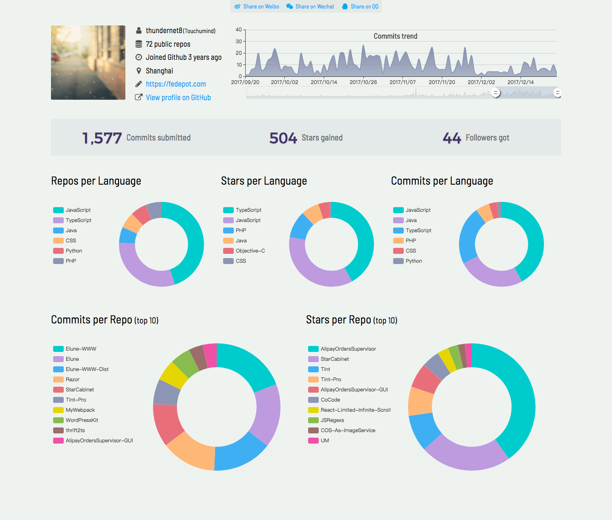

<div align="center">

## GithubProfile

**Visualizing GitHub profile .**

[](https://github.com/thundernet8/GithubProfile/issues)
[](https://github.com/thundernet8/GithubProfile/network)
[](https://github.com/thundernet8/GithubProfile/stargazers)
[](https://david-dm.org/thundernet8/CustomTSLintRules)
[](https://travis-ci.org/thundernet8/GithubProfile)
[](https://github.com/thundernet8/GithubProfile/blob/master/LICENSE)
[](https://github.com/prettier/prettier)

</div>

<br>

## About

Inspired by [tipsy](https://github.com/tipsy/github-profile-summary). This instance was finished with React/Koa/Echarts, support server-side rendering

Live at [https://gp.fedepot.com](https://gp.fedepot.com)

## Screenshot



## Usage

### Dev

Configure env

```shell
cp envrc.sample envrc
```

edit the envrc file

Start api server

```shell
npm run build:api
node server/index.js
```

Start React dev

```shell
npm run dev
```

## Production

Configure env

```shell
cp envrc.sample envrc
```

edit the envrc and env.ts file

Build all resources

```shell
npm run build:all
```

Start Api server

```shell
npm run start:api
```

Start SSR server

```shell
npm run start:ssr
```

Configure Nginx reverse proxy

[Sample file](deploy/nginx/nginx.conf)

**Notes: Redis server should be installed and the host,port,password information should writed to envrc file**

## Docker deploy

Build all resources

```shell
npm run build:all
```

Configure env

```shell
cp envrc.sample envrc
```

edit the envrc and deploy/nginx.conf

For first time:

```shell
cd deploy && docker-compose up
```

Next times:

```shell
cd deploy && docker-compose start
```

For https home address, copy nginx-ssl.conf to cover nginx.conf.
